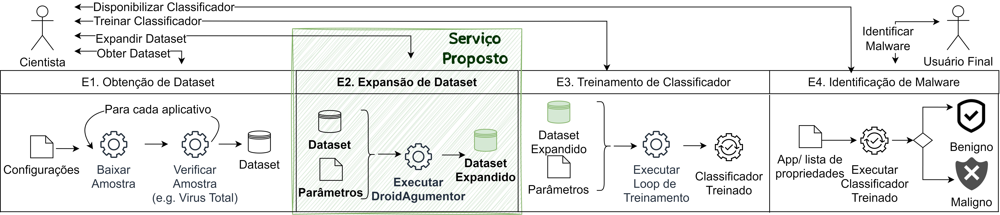
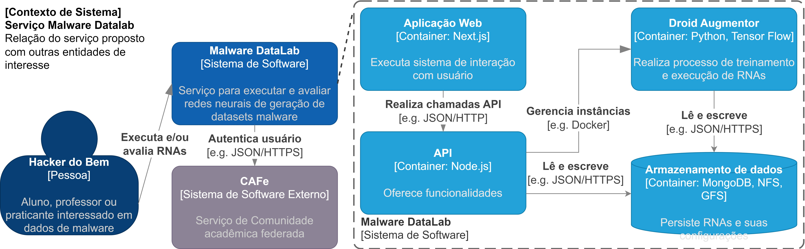
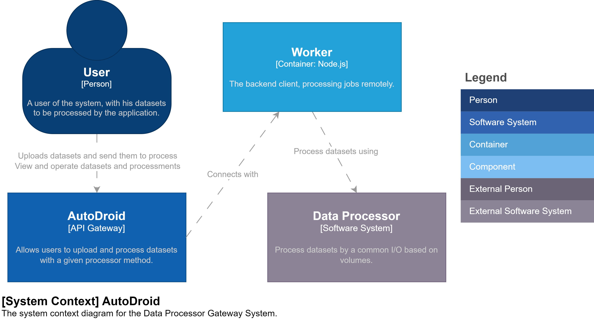
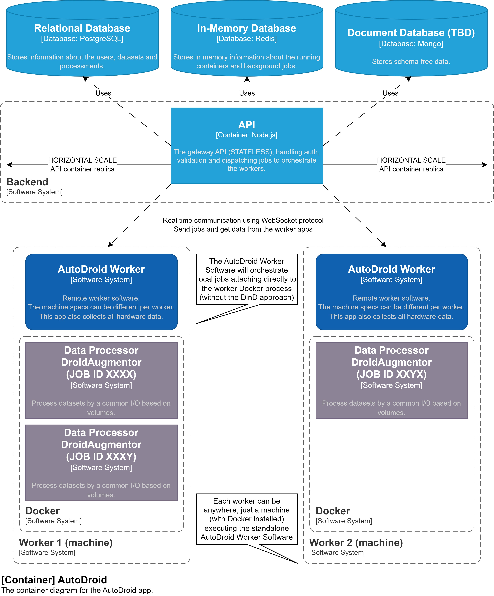
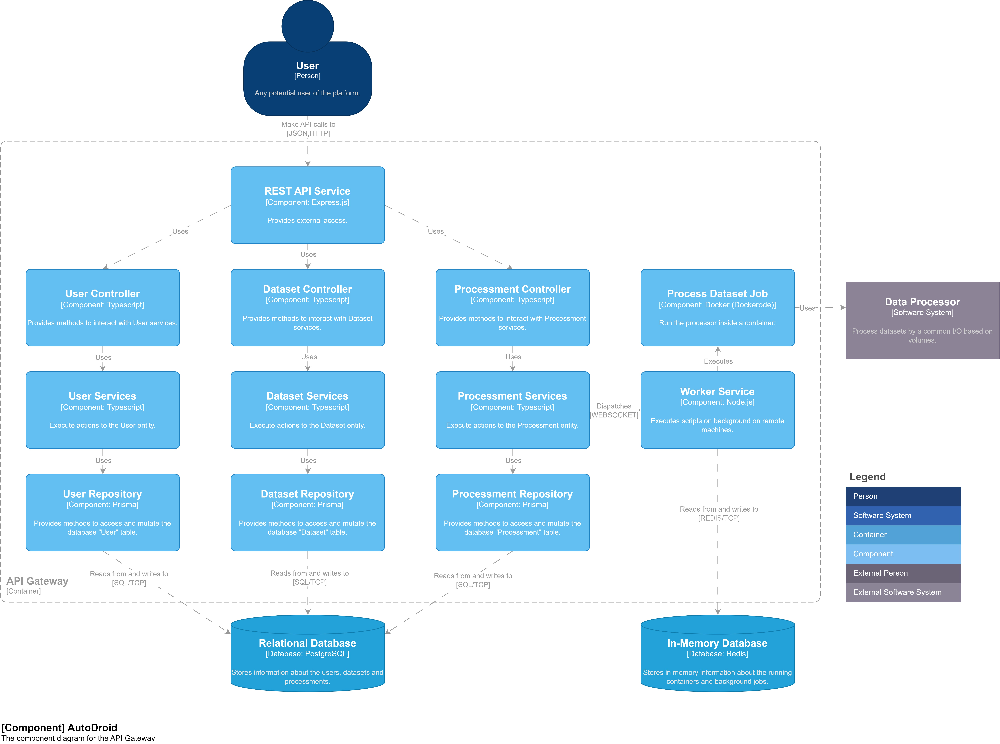

<p align="center">
  <a href="" rel="noopener">
    
  </a>
</p>

<h3 align="center">AutoDroid</h3>

<div align="center">

[]()

</div>

---

## 📝 Índice <a name="summary"></a>

- [Sobre](#about)
- [Visão Geral do Projeto](#overview)
- [Requisitos Funcionais e Não Funcionais](#project_requirements)
- [Arquitetura](#architecture)
- [Tecnologias](#built_using)
- [Ambiente do Usuário](#user_environment)
- [Primeiros passos](#getting_started)
- [Utilização](#usage)
- [Testes](#tests)
- [Deployment](#deployment)
- [Resolução de problemas](#troubleshooting)
- [Contribuições](./CONTRIBUTING.md)
- [Changelog](./CHANGELOG.md)
- [Referências](#bibliography)

## 📖 Sobre <a name = "about"></a>

Este repositório contém o monorepo para a aplicação AutoDroid.

### Motivação

Os Hackers do Mal estão utilizando técnicas de IA (Inteligência Artificial) para realizar “mutações” em malware, dificultando sua detecção, que afeta os usuários de computadores e dispositivos móveis, dentre outras tecnologias que possam estar sujeitas a ataque de malware, gerando um aumento do nível de proliferação de malware: um dos maiores desafios da segurança da informação.

Os Hackers do Bem podem enfrentar esta proliferação de malwares utilizando ferramentas de IA como o DroidAugmentor para que a detecção dos malwares “mutantes” seja amplamente aprimorada.

Todavia ferramentas tais como a DroidAugmentor manualmente pode ser uma tarefa muito complexa e nada escalável, criando uma grande barreira de aprendizagem e utilização da ferramenta.

Encapsular aplicativos em contêineres Docker pode ser uma solução para esse problema, mas ainda é um processo muito manual e não é muito fácil de gerenciar.

### Solução

Ao oferecer ferramentas como a DroidAugmentor como um serviço, torna sua execução escalável, de fácil aprendizado e com melhor aproveitamento para experimentação.

## ✨ Visão Geral do Projeto <a name="overview"></a>

O serviço proposto se trata da etapa de expansão de Dataset na pipeline de AutoML, conforme apresentado em [DroidAugmentor](https://sol.sbc.org.br/index.php/sbseg_estendido/article/view/27273).



O projeto é composto por diversas partes, com o objetivo final de oferecer uma ferramenta escalável para executar instâncias da DroidAugmentor.



## ✅ Requisitos Funcionais (Histórias de Usuário) e Requisitos Não Funcionais <a name="project_requirements"></a>

O documento de visão/requisitos pode ser acessado [aqui](https://docs.google.com/document/d/1tCNZw9VFt5honSpTOx_DjVQ7-l0qdYta/edit?usp=sharing&ouid=105354267831258985184&rtpof=true&sd=true).

## 🏦 Arquitetura <a name="architecture"></a>

Este repositório contém o monorepo para a aplicação AutoDroid, cuja [Estrutura do Código](./CODEBASE_STRUCTURE.md) está disponível na pasta ```./docs``` deste repositório.

O núcleo desta aplicação é o backend, que é uma API REST/GraphQL construída usando Node.js e Express, e está disponível na pasta ```./packages/backend``` deste repositório.

Seguindo o [modelo C4](https://c4model.com/), a arquitetura do back-end é apresentada a seguir:

Visão de sistema:


Visão de contêiner:


Visão de componente:


### Entidades

- `User`: representa um usuário da aplicação. Nenhum dado pessoal é coletado, é apenas um identificador anônimo.
- `Processor`: representa um processador que será usado para processar um conjunto de dados. É uma imagem Docker que será usada para processar a solicitação de processamento do usuário com os parâmetros fornecidos.
- `Dataset`: representa um conjunto de dados que será usado por um processador, é um arquivo que será usado como entrada para o processador.
- `Processing`: representa uma solicitação de processamento feita por um usuário. É uma solicitação para processar um conjunto de dados usando um processador com os parâmetros fornecidos. Todo o ciclo de vida do processamento está disponível nesta entidade, incluindo o status de execução e seu resultado.

### Estrutura do código

A estrutura interna é apresentada em [estrutura do código](./CODEBASE_STRUCTURE.md) e guiada pelo documento de [Guidelines de Código](./CODE_GUIDELINES.md).

A proposta de arquitetura do back-end é baseada em [DDD](https://en.wikipedia.org/wiki/Domain-driven_design) e [Clean Architecture](https://blog.cleancoder.com/uncle-bob/2012/08/13/the-clean-architecture.html). É guiada por princípios de SOLID e visa a separação de responsabilidades, facilitando a manutenção e evolução do código. Além disso, é proposto o método de desenvolvimento [TDD](https://en.wikipedia.org/wiki/Test-driven_development) para garantir a qualidade do código guiado por testes.

## ⛏️ Tecnologias Utilizadas <a name = "built_using"></a>

- [TypeScript](https://www.typescriptlang.org/) - Linguagem de programação
- [Node.js](https://nodejs.org/) - Ambiente de execução
- [Express](https://www.fastify.io/) - Framework web
- [Docker](https://www.docker.com/) - conteinerização
- [PostgreSQL](https://www.postgresql.org/) - Banco de dados
- [Redis](https://redis.io/) - Banco de dados em memória
- [Tsyringe](https://github.com/microsoft/tsyringe) - Injeção de dependência
- [Prisma](https://www.prisma.io/) - ORM
- [Bull](https://optimalbits.github.io/bull/) - Gerenciador de filas
- [Dockerode](https://github.com/apocas/dockerode) - API Docker
- [Vitest](https://vitest.dev/) - Framework de testes
- [Yarn](https://yarnpkg.com/) - Gerenciador de pacotes

### Geral

É importante mencionar as demais ferramentas que serão utilizadas nas duas partes do projeto:

- [Git](https://git-scm.com/) - Controle de versão
- [Husky](https://typicode.github.io/husky/#/) - Hooks do Git
- [Lint Staged](https://github.com/okonet/lint-staged) - Ferramenta para verificar arquivos commitados
- [Commitizen](https://github.com/commitizen/cz-cli) - Auxiliar para mensagens de commit do Git
- [Commitlint](https://commitlint.js.org/) - Verificador de mensagens de commit do Git
- [Standard Version](https://github.com/conventional-changelog/standard-version) - Gerador de changelog
- [Eslint](https://eslint.org/) - Framework de verificação de código
- [Prettier](https://prettier.io/) - Formatador de código
- [Semver](https://semver.org/) - Versionamento semântico

## 💻 Ambiente do Usuário <a name="user_environment"></a>

O ambiente do usuário final (utilizador) deverá ter um dispositivo (seja fixo ou móvel) com acesso à internet e com ao menos uma ferramenta de navegação para acessar a versão web do produto ou um cliente de API REST/GraphQL (ex.: curl, httpie, postman, insomnia) previamente instalado em seu dispositivo.

## 🏁 Primeiros Passos <a name = "getting_started"></a>

Estas instruções irão ajudá-lo a obter uma cópia deste projeto e executá-lo em sua máquina local para fins de desenvolvimento e teste. Consulte [deployment](#deployment) para obter informações sobre como implantar o projeto em ambiente produtivo.

Existem duas maneiras de executar esta aplicação, usando o Docker ou executando manualmente em sua máquina local.

Os seguintes passos irão guiá-lo através do processo de execução desta aplicação de forma automatizada, usando o Docker.

Para começar, a máquina que executará esta aplicação deve atender aos seguintes requisitos, considerando a execução através do [Docker](https://docs.docker.com/get-docker/):

### Requisitos Mínimos <a name = "minimum_requirements"></a>

- Sistema operacional Linux (por exemplo, Ubuntu, Debian e outros...) (MacOS/Windows é experimental)
- Virtualização habilitada na BIOS
- Mínimo de 4GB de RAM
- Mínimo de 10GB de espaço livre em disco, dependendo dos "processadores" disponíveis (para arquivos, resultados de processamento, banco de dados e imagens Docker)
- [Git](https://git-scm.com/downloads) instalado
- [Docker](https://docs.docker.com/get-docker/) instalado

### Instalação

Usando o terminal, clone este repositório em sua máquina local usando o Git:

```bash
git clone https://github.com/luizfelipelaviola/autodroid.git
```

Navegue até a pasta do repositório:

```bash
cd autodroid
```

Execute o script ```start.sh```:

```bash
./start.sh
```

Este script irá iniciar a aplicação usando o Docker compose.
A inicialização da aplicação pode levar alguns minutos, dependendo da sua conexão com a internet e do tamanho dos "processadores" fornecidos.
O terminal deve ser mantido aberto durante a execução da aplicação.

Se a inicialização for bem-sucedida, você verá algumas mensagens no console, como por exemplo:

```bash
autodroid_api_gateway_prod  | 🆗 Database connection success.
autodroid_api_gateway_prod  | 🆗 Redis default connection success.
autodroid_api_gateway_prod  | 🆗 Image someImage:latest loaded.
autodroid_api_gateway_prod  | 🆗 Docker dataset processor provider connection success.
autodroid_api_gateway_prod  | 🆗 Processing background jobs on @autodroid/api.
autodroid_api_gateway_prod  | ⚡️ @autodroid/api production version X using Node.js X running at port 3333 with PID X.
```

After successfully starting the application, you can run a demo executing the following script on another terminal:

```bash
./demo.sh
```

Ou você pode continuar manualmente e usá-lo seguindo as instruções de [uso](#usage).

Para parar a aplicação, pressione ```Ctrl + C``` no terminal ou execute ```docker compose down``` na raiz deste repositório, caso esteja executando a aplicação em modo destacado.

Por padrão, uma pasta `./runtime` será criada na raiz deste repositório para armazenar os arquivos em tempo de execução da aplicação, incluindo o banco de dados e os arquivos enviados, que são utilizados para persistir os dados entre as execuções da aplicação. Considerando isso, às vezes, para excluir essa pasta, devido ao comportamento padrão do Docker, pode ser necessário utilizar um usuário administrador do sistema / root (sudo).

A pasta `./runtime` também é útil para estudar a estrutura de dados da aplicação e fazer backup dos dados da aplicação. Por favor, lembre-se de que a pasta do Docker pode solicitar que você esteja logado como usuário administrador do sistema / root (sudo) para ser visualizada.

### Manual Setup <a name="manual_setup"></a>

Executar esta aplicação usando o ambiente Docker compose é a forma recomendada, evitando a instalação manual de cada dependência.

Um guia para configurar o projeto manualmente está disponível no guia de [configuração manual](./MANUAL_SETUP.md).

## 📱 Utilização <a name="usage"></a>

Esta aplicação fornece uma API REST/GraphQL no ambiente Docker compose.

Por padrão, estará disponível em sua máquina local nos seguintes URLs:
- API REST (porta 3333): http://localhost:3333
- API GraphQL (porta 3333): http://localhost:3333/graphql

Esta URL estará disponível até que a aplicação seja interrompida.

Para usar a API diretamente, você pode seguir as instruções na [documentação da API](./API.md) ou pode usar ferramentas de cliente HTTP como [Postman](https://www.postman.com/) ou [Insomnia](https://insomnia.rest/). Há uma [coleção do Insomnia](./collections/Insomnia.json) na pasta ```./docs/collections``` deste repositório que você pode importar para sua aplicação cliente HTTP.

### Usuário/Autorização

Esta aplicação usa autenticação através do provedor Firebase, sendo necessário o envio do header `Authorization` em cada requisição, com o respectivo valor `Bearer ${token}`.

### Processador

Os processadores (aplicações como o DroidAugmentor) disponíveis podem ser alterados apenas manualmente pelo administrador da aplicação usando o arquivo [processors.json](../packages/backend/shared/processors.json). Este arquivo é carregado na inicialização da aplicação e é usado para definir os processadores disponíveis, suas configurações e as imagens necessárias a serem obtidas do Docker Hub.

Os parâmetros de configuração são descritos abaixo:
- `code`: o identificador do processador, usado para referenciá-lo na solicitação de processamento.
- `name`: o nome do processador.
- `description`: a descrição do processador.
- `image`: a imagem Docker do processador, usada para obtê-la do Docker Hub. A imagem de destino deve ser pública.
- `input_arg`: a chave do argumento que será usada para passar o caminho do arquivo de conjunto de dados para o processador.
- `input_dir`: o diretório onde o arquivo de conjunto de dados será colocado no contêiner do processador usando volumes.
- `output_arg`: a chave do argumento que será usada para passar o caminho do arquivo de resultado do processamento para o processador.
- `output_dir`: o diretório onde o arquivo de resultado do processamento será colocado no contêiner do processador usando volumes.
- `command`: o comando que executa a ação desejada no contêiner do processador, usando os argumentos fornecidos.
- `allowed_params`: a lista de chaves de parâmetros aceitos para o processador.
- `allowed_mime_types`: a lista de tipos MIME aceitos para o arquivo de conjunto de dados. Isso também afetará a validação do upload do arquivo de conjunto de dados.
- `default_params`: os parâmetros padrão para o processador. Serão usados se o parâmetro especificado não for fornecido na solicitação de processamento.

Após alterar o processors.json, se estiver executando no Docker ou em um ambiente de produção, será necessário reiniciar a aplicação para aplicar as alterações.

Para reconstruir a aplicação usando o ambiente Docker compose, você pode executar o seguinte comando na raiz deste repositório:

```bash
docker compose build
```

E então você pode executar o script `./start.sh` novamente.

Para reconstruir a aplicação manualmente novamente para produção, você pode seguir as instruções na seção [configuração manual](#manual_setup).

### Conjunto de Dados

O arquivo de conjunto de dados pode ser enviado pelo usuário usando a API. O arquivo de conjunto de dados deve ser um arquivo válido com um tipo MIME válido, de acordo com a configuração do processador.

Há um [exemplo de conjunto de dados](./samples/dataset_example.csv) na pasta ```./docs/samples``` deste repositório que você pode usar para testar a aplicação.

A referência do usuário é apenas para mencionar o usuário que enviou o arquivo de conjunto de dados.
Ele pode ser baixado, alterado ou excluído por qualquer outro usuário.

### Processamento

A solicitação de processamento pode ser feita pelo usuário usando a API. A solicitação de processamento deve ser feita por um usuário válido e deve conter um arquivo de conjunto de dados válido e um processador válido seguido dos parâmetros desejados.

A solicitação de processamento será enfileirada e processada pela aplicação, e o resultado do processamento estará disponível na entidade de processamento. O processo pode levar vários minutos, horas ou até mesmo dias, dependendo do processador e do arquivo de conjunto de dados.

A referência do usuário é apenas para mencionar o usuário que solicitou o processamento.
Ele pode ser baixado, alterado ou excluído por qualquer outro usuário.

### Fluxo comum

O fluxograma a seguir descreve o fluxo comum da aplicação:

<p align="center">
  
</p>

## ✅ Testes <a name = "tests"></a>

Para executar os testes, por favor execute o comando abaixo:
```bash
yarn test
```

A cobertura de código e outros relatórios serão gerados na pasta `./packages/backend/test/outputs`.

## 🚀 Deployment <a name = "deployment"></a>

Esta aplicação está pronta para implantação com Docker e docker compose.

Para implantar o backend em uma Máquina Virtual, faça um clone deste repositório no destino, selecione o branch desejado e, após atender aos requisitos, execute os seguintes comandos:

```bash
docker compose build
```

Depois que a aplicação for construída, preencha o arquivo ```docker-compose.yml``` com suas variáveis de ambiente e execute o seguinte comando:

```bash
docker compose up -d
```

Certifique-se de que seus Firewalls, Balanceadores de Carga e DNS estejam bem configurados.

## 🛠 Solução de Problemas <a name = "troubleshooting"></a>

O Docker é incrível, mas às vezes pode ser um pouco complicado. Alguns erros podem ocorrer durante a execução da aplicação, e alguns deles podem estar relacionados ao Docker.

### Erros antes da inicialização

Se você estiver enfrentando alguns erros antes da inicialização da aplicação, verifique os seguintes itens:

- Verifique se você tem os [requisitos](#minimum_requirements) instalados em sua máquina.
- Verifique se você tem o [Docker](https://docs.docker.com/get-docker/) em execução em sua máquina.
- Verifique se você tem espaço livre suficiente em seu disco, pelo menos 10GB.
- Verifique se você pode baixar outras imagens do Docker Hub, como `docker run --rm hello-world:latest`.

### Limpando o ambiente do Docker

Se você estiver enfrentando alguns erros relacionados ao Docker, você pode tentar limpar o ambiente do Docker executando os seguintes comandos:

```bash
# Pare todos os containers
docker compose down
docker stop $(docker ps -q)

# Remova todos os arquivos da pasta runtime
sudo rm -rf ./.runtime

# Remova todas as imagens relacionadas a este projeto
docker rmi $(docker images -q -f "reference=autodroid_*")

# Reinicie o serviço de rede
sudo systemctl restart NetworkManager.service

# (Opcional) Limpe o ambiente do Docker
docker system prune -a
```

### Verificando as etapas de inicialização

Se você estiver enfrentando alguns erros durante a inicialização da aplicação, você pode verificar as etapas da inicialização executando os seguintes comandos:

```bash
# Tente usar qualquer imagem do Docker Hub que não esteja em sua máquina para verificar se o Docker instalado está funcionando como esperado
docker rmi hello-world
docker run --rm hello-world:latest

# Tente construir a aplicação manualmente, em caso de erro, envie a mensagem de erro para o mantenedor do projeto
docker compose build --no-cache
```

Após executar essas etapas, se o erro persistir, por favor abra uma issue neste repositório.

## 📖 Referências <a name="bibliography"></a>

CASOLA, Karina; PAIM, Kayuã Oleques; MANSILHA, Rodrigo Brandão; KREUTZ, Diego. DroidAugmentor: uma ferramenta de treinamento e avaliação de cGANs para geração de dados sintéticos. In: SALÃO DE FERRAMENTAS - SIMPÓSIO BRASILEIRO DE SEGURANÇA DA INFORMAÇÃO E DE SISTEMAS COMPUTACIONAIS (SBSEG), 23. , 2023, Juiz de Fora/MG. Anais [...]. Porto Alegre: Sociedade Brasileira de Computação, 2023 . p. 57-64. DOI: https://doi.org/10.5753/sbseg_estendido.2023.235793.

LAVIOLA, Luiz Felipe; PAIM, Kayuã Oleques; KREUTZ, Diego; MANSILHA, Rodrigo Brandão. AutoDroid: disponibilizando a ferramenta DroidAugmentor como serviço. In: ESCOLA REGIONAL DE REDES DE COMPUTADORES (ERRC), 20. , 2023, Porto Alegre/RS. Anais [...]. Porto Alegre: Sociedade Brasileira de Computação, 2023 . p. 145-150. DOI: https://doi.org/10.5753/errc.2023.929.
