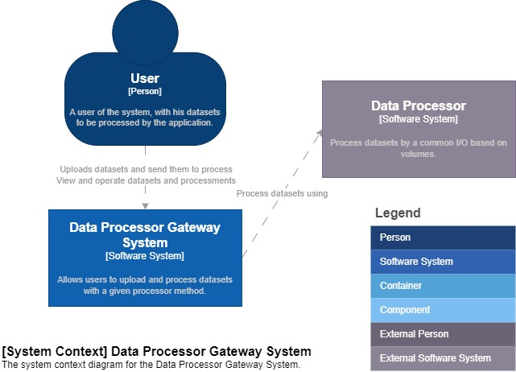
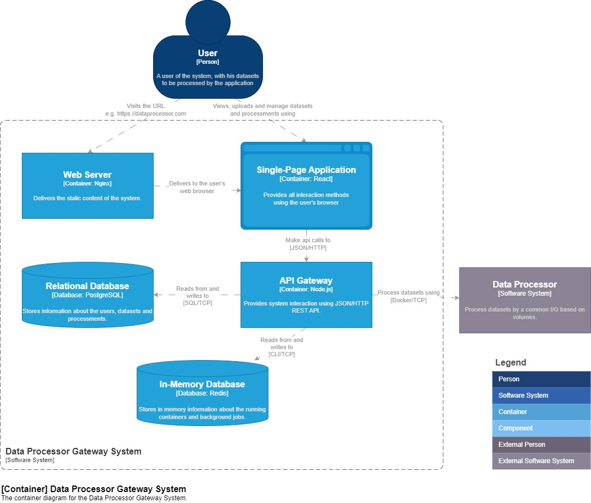
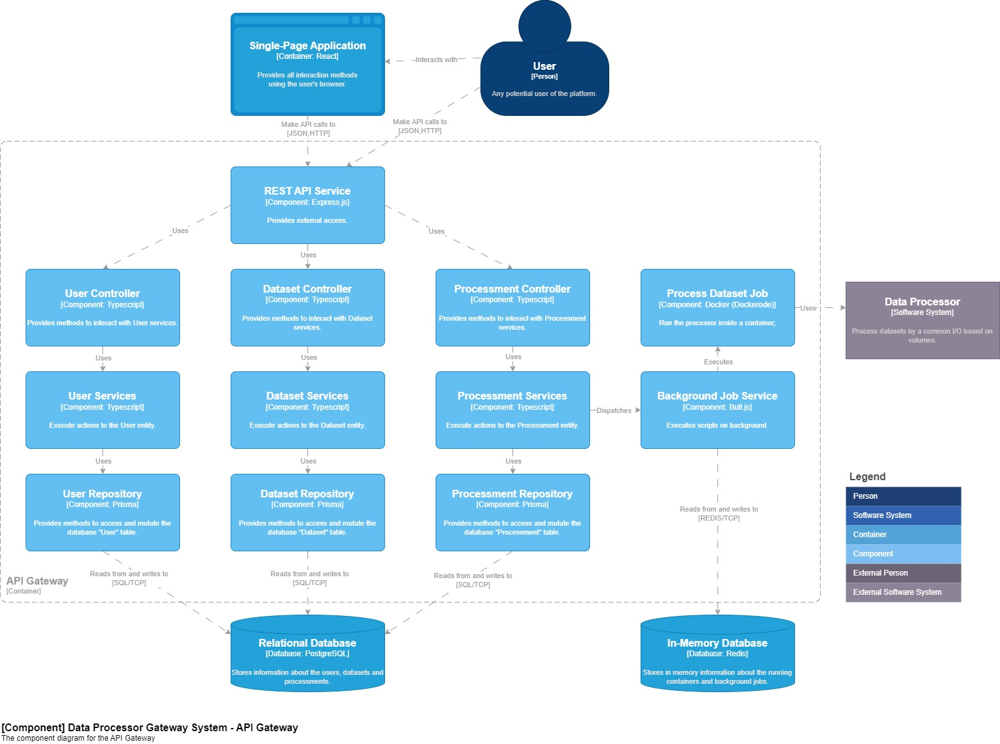

<p align="center">
  <a href="" rel="noopener">
    
  </a>
</p>

<h3 align="center">AutoDroid</h3>

<div align="center">

[]()

</div>

---

## 📝 Table of Contents

- [About](#about)
- [Getting Started](#getting_started)
- [Deployment](#deployment)
- [Usage](#usage)
- [Troubleshooting](#troubleshooting)
- [Built Using](#built_using)
- [Contributing and Coworking](./CONTRIBUTING.md)
- [Changelog](./CHANGELOG.md)
- [Codebase Structure](./CODEBASE_STRUCTURE.md)
- [Code Guidelines](./CODE_GUIDELINES.md)

## 📖 About <a name = "about"></a>

This repository contains the monorepo for the AutoDroid application.

### Motivation

Running applications, for multiple purposes like data processing or even testing, can be a very time consuming task, considering the requisite to install all its dependencies, configure it, and run it.

Encapsulating applications into Docker containers can be a solution for this problem, but it's still a very manual process, and it's not very easy to manage.

### Solution

AutoDroid is an application that allows users to execute a given external application by a REST API.

This software provides a pre-configured list of applications, here called "processor", consisting in a Docker image with its standard input and output configuration and possible parameters.

Acting as a manager/orchestrator of the executions using Docker containers, it's possible to run multiple applications using this software at the same time, and even manage its lifecycle.

## 🏁 Getting Started <a name = "getting_started"></a>

These instructions will get you a copy of the project up and running on your local machine for development and testing purposes. See [deployment](#deployment) for notes on how to deploy the project on a live system.

There are two ways to run this application, using Docker or running it manually on your local machine.

The following steps will guide you through the process of running this application by an automated way, using Docker.

To get started, the machine that will run this application must have the following requirements:

### Host Requirements <a name = "requirements"></a>

- Linux OS (e.g. Ubuntu, Debian, and others...) (MacOS/Windows is experimental)
- Virtualization enabled on BIOS
- Minimum of 4GB of RAM
- Minimum of 10GB of free disk space depending on the available "processors" (for files, processing result, database and Docker images)
- [Git](https://git-scm.com/downloads) installed
- [Docker](https://docs.docker.com/get-docker/) installed

### Installing

Using your terminal, clone this repository on your local machine using Git:

```bash
git clone https://github.com/luizfelipelaviola/autodroid.git
```

Navigate to the repository folder:

```bash
cd autodroid
```

Execute the ```start.sh``` script:

```bash
./start.sh
```

This script will start the application using Docker compose.
The startup of the application may take a few minutes, depending on your internet connection and the size of the given "processors".
The terminal must be kept open during the application execution.

If the startup was successful, you should see some console messages like the following ones:

```bash
autodroid_api_gateway_prod  | 🆗 Database connection success.
autodroid_api_gateway_prod  | 🆗 Redis default connection success.
autodroid_api_gateway_prod  | 🆗 Image someImage:latest loaded.
autodroid_api_gateway_prod  | 🆗 Docker dataset processor provider connection success.
autodroid_api_gateway_prod  | 🆗 Processing background jobs on @autodroid/api.
autodroid_api_gateway_prod  | ⚡️ @autodroid/api production version X using Node.js X running at port 3333 with PID X.
```

After successfully starting the application, you can run a demo executing the following script on another terminal:

```bash
./demo.sh
```

Or you can continue manually can use it by following the [usage](#usage) instructions.

To stop the application, press ```Ctrl + C``` on the terminal or run ```docker compose down``` on the root of this repository in case you are running the application on detached mode.

By default a folder `./runtime` will be created on the root of this repository to store the application runtime files, including the database and the uploaded files, which is used to persist the data between application executions. Considering that, sometimes to delete this folder, due the Docker permissions, you may need to delete this folder logged as the system administrator user / root (sudo).

The `./runtime` folder is useful also to study the application data structure and to backup the application data. Please remember that the Docker folder may request to be logged as the system administrator user / root (sudo) to be opened.

### Manual Setup <a name="manual_setup"></a>

Running this application using the Docker compose environment is the recommended way to run it, avoiding to installing each dependency manually.

A guide to setup the project manually is available at the [manual setup](./MANUAL_SETUP.md) guide.

## 📱 Usage <a name="usage"></a>

This application provides a REST API on the Docker compose environment.

By default, it will be available on your local machine on the following URLs:
- REST API (port 3333): http://localhost:3333

This url will be available until the application is stopped.

To use the REST API directly, you can follow the instructions at the [API documentation](./API.md) or you can use REST client tools like [Postman](https://www.postman.com/) or [Insomnia](https://insomnia.rest/). There's a [Insomnia collection](./collections/Insomnia.json) on the ```./docs/collections``` folder of this repository that you can import to your REST client application.

### Entities

- `User`: represents a user of the application. No personal data is collected, it's just an anonymous identifier.
- `Processor`: represents a processor that will be used to process a dataset. It's a Docker image that will be used to process the user processing request with given parameters.
- `Dataset`: represents a dataset that will be used by a processor, it's a file that will be used as input for the processor.
- `Processing`: represents a processing request made by a user. It's a request to process a dataset using a processor with given parameters. The entire processing lifecycle is available on this entity, including the running status and its result.

### User/Authorization

This application uses anonymous authentication by just providing a existing user id on the `Authorization` header of the request, followed by the `Bearer ${id}` keyword.

### Processor

The available processors can be changed only manually by the application administrator using the [processors.json](../packages/backend/shared/processors.json) file. This file is loaded on the application startup and it's used to define the available processors, its configurations and the necessary images to be pulled from Docker Hub.

The configuration parameters are described below:
- `code`: the identifier of the processor, used to reference it on the processing request.
- `name`: the name of the processor.
- `description`: the description of the processor.
- `image`: the Docker image of the processor, used to pull it from Docker Hub. The target image should be public.
- `input_arg`: the key of the argument that will be used to pass the dataset file path to the processor.
- `input_dir`: the directory where the dataset file will be placed on the processor container using volumes.
- `output_arg`: the key of the argument that will be used to pass the processing result file path to the processor.
- `output_dir`: the directory where the processing result file will be placed on the processor container using volumes.
- `command`: the command that executes the desired action on the processor container, using the given arguments.
- `allowed_params`: the list of accepted parameter keys for the processor.
- `allowed_mime_types`: the list of accepted MIME types for the dataset file. Will impact on the dataset file upload validation also.
- `default_params`: the default parameters for the processor. Will be used if the specified parameter is not provided on the processing request.

After changing the processors.json, if running on Docker or a production environment, you'll need to restart the application to apply the changes.

To rebuild the application using the Docker compose environment, you can run the following command on the root of this repository:

```bash
docker compose build
```

And then you can run the `./start.sh` script again.

To build the application manually again for production, you can follow the instructions at the [manual setup](#manual_setup) section.

### Dataset

The dataset file can be uploaded by the user using the REST API. The dataset file must be a valid file with a valid MIME type, according to the processor configuration.

There is a [dataset example](./samples/dataset_example.csv) on the ```./docs/samples``` folder of this repository that you can use to test the application.

The user reference is just to mention the user that uploaded the dataset file.
It can be downloaded, changed or deleted by any other user.

### Processing

The processing request can be made by the user using the REST API. The processing request must be made by a valid user and must contain a valid dataset file and a valid processor followed by the desired parameters.

The processing request will be queued and processed by the application, and the processing result will be available on the processing entity. The process can take a several minutes, hours or even days depending on the processor and the dataset file.

The user reference is just to mention the user that requested the processing.
It can be downloaded, changed or deleted by any other user.

### Common flow

The following flowchart describes the common flow of the application:

<p align="center">
  
</p>

## 🏛 Architecture <a name="architecture"></a>

This repository contains the monorepo for the AutoDroid application, which [Codebase Structure](./CODEBASE_STRUCTURE.md) is available at the ```./docs``` folder of this repository.

The core of this application is the backend, which is a REST API built using Node.js and Express, and it's available at the ```./packages/backend``` folder of this repository.

The system view of the backend is described on the following [C4 model](https://c4model.com/) diagram:

<p align="center">
  
</p>

The container view of the backend is described on the following [C4 model](https://c4model.com/) diagram:

<p align="center">
  
</p>

The component view of the backend is described on the following [C4 model](https://c4model.com/) diagram:

<p align="center">
  
</p>

## 🔧 Running the tests <a name = "tests"></a>

To run tests, please execute the command below:
```bash
yarn test
```

Code coverage will be generated on `__tests__` page

## 🚀 Deployment <a name = "deployment"></a>

This application is ready for Docker and docker compose deployment.

To backend deployment on a Virtual Machine, make a clone of this repository on the target, select the desired branch, and, after completing the requirements, run the following commands:

```bash
docker compose build
```

Once the application was built, fill ```docker-compose.yml``` with your environment variables and run the following command:

```bash
docker compose up -d
```

Make sure that your Firewalls, Load Balancers and your DNS is well configured.

## 🛠 Troubleshooting <a name = "troubleshooting"></a>

The Docker universe is awesome, but sometimes it can be a little bit tricky. Some errors may occur during the application execution, and some of them might be related to Docker.

### Errors before the application startup

If you are facing some errors before the application startup, please check the following items:

- Check if you have the [requirements](#requirements) installed on your machine.
- Check if you have the [Docker](https://docs.docker.com/get-docker/) running on your machine.
- Check if you have enough free disk space on your machine, at least 10GB.
- Check if you can pull another images from Docker hub, like `docker run --rm hello-world:latest`.

### Cleaning the Docker environment

If you are facing some errors related to Docker, you can try to clean the Docker environment by running the following commands:

```bash
# Stop all containers
docker compose down
docker stop $(docker ps -q)

# Remove all files from the runtime folder
sudo rm -rf ./.runtime

# Remove all images related to this project
docker rmi $(docker images -q -f "reference=autodroid_*")

# Restart your network service
sudo systemctl restart NetworkManager.service

# (Optional) Prune your Docker environment
docker system prune -a
```

### Checking the steps

If you are facing some errors during the application startup, you can check the steps of the startup by running the following commands:

```bash
# Try to use any image from Docker Hub that isn't in your machine
docker rmi hello-world
docker run --rm hello-world:latest

# Try to build the application manually, in case of error, send the error message to the project maintainer
docker compose build --no-cache
```

After running this steps, if the error persists, please open an issue on this repository.

## ⛏️ Built Using <a name = "built_using"></a>

### Backend

- [Node](https://nodejs.org/) - Javascript runtime
- [Docker](https://www.docker.com/) - Container runtime
- [Redis](https://redis.io/) - In-memory database
- [PostgreSQL](https://www.postgresql.org/) - Database
- [Express](https://expressjs.com/) - Framework
- [Tsyringe](https://github.com/microsoft/tsyringe) - Dependency injection
- [Prisma](https://www.prisma.io/) - ORM
- [TypeScript](https://www.typescriptlang.org/) - Javascript with syntax for types
- [Bull](https://github.com/OptimalBits/bull) - Queue manager
- [Dockerode](https://github.com/apocas/dockerode) - Docker API
- [Yarn](https://yarnpkg.com/) - Package manager
- [Yarn Workspaces](https://classic.yarnpkg.com/en/docs/workspaces/) - Monorepo management

### General

It's important to mention this tools/patterns which guides the application lifecycle:

- [Git](https://git-scm.com/) - Version control
- [Husky](https://typicode.github.io/husky/#/) - Git hooks
- [Lint Staged](https://github.com/okonet/lint-staged) - Tool to lint commit staged files
- [Commitizen](https://github.com/commitizen/cz-cli) - Git commit message helper
- [Commitlint](https://commitlint.js.org/) - Git commit message linter
- [Standard Version](https://github.com/conventional-changelog/standard-version) - Changelog generator
- [Eslint](https://eslint.org/) - Linter framework
- [Prettier](https://prettier.io/) - Code formatter
- [Semver](https://semver.org/) - Semantic versioning
